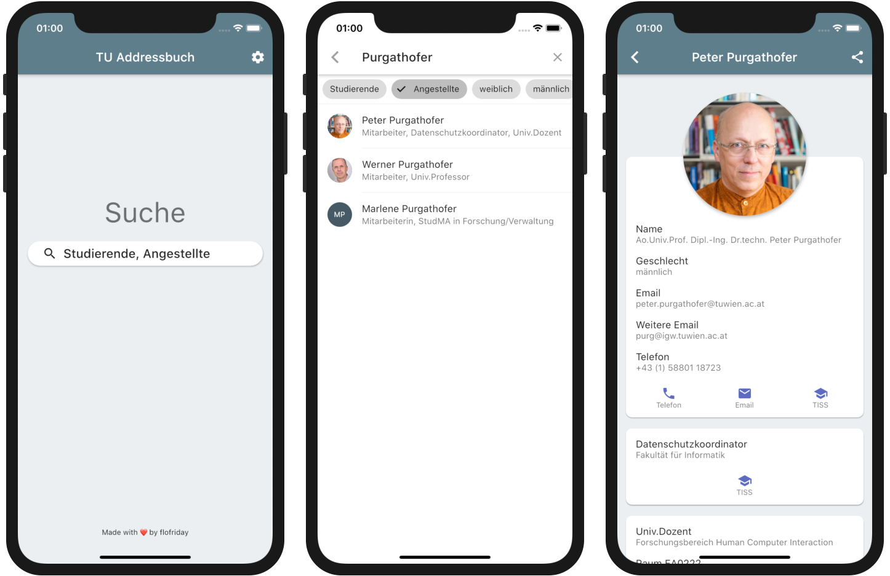

# TU Wien Addressbook
A very simple Android and iOS App to search [TU Wien](https://www.tuwien.at/en/) employees and students.



[Download](https://github.com/flofriday/TU_Wien_Addressbook/releases/latest) the latest release for Android.

**Warning :** While the data this app displays comes from an official TU Wien
API, the app itself is not official!

## Build it yourself
1) [Install Flutter](https://flutter.dev/docs/get-started/install)
2) Clone this repository, or download it.
3) Connect your phone to your computer.
4) Run `flutter install` in your terminal (you must first change into the directory of the repository).

## Todo for 1.0.0
* Add loading idicator
* Add offline warning
* Improve Loading speeds even more
* Add selectors if multiple emails, websites etc are available

## Frequently asked Question

### Where do you get the data from ?
Actually, there is an official 
[TISS REST API](https://tiss.tuwien.ac.at/api/dokumentation). While the API is 
public (or semi-public, but I will come back to this later), the documentation 
is not, so you need to be able to login to [TISS](https://tiss.tuwien.ac.at/).

If you don't have access to [TISS](https://tiss.tuwien.ac.at/), don't worry as 
many aspects of the API are not documented, anyway. For example, there is no 
documentation about what the response json looks like or that you can set 
the language via a query parameter or that you will only receive student
information if you are logged in.

To search people on the API, I use the `/api/person/v22/psuche` endpoint.
Here is a full example:
```
https://tiss.tuwien.ac.at/api/person/v22/psuche?q=Panholz&max_treffer=50
```

Here is a list of all query parameters:
| Name        |  Type | Datatype | Description                                                                                                    |
|-------------|:-----:|---------:|----------------------------------------------------------------------------------------------------------------|
| q           |  path |   string | Searchterm                                                                                                     |
| intern      | query |     bool | If internal persons(like students) should be included. This only works if you are logged in. Default is false. |
| max_treffer | query |      int | Upper limit of results. Limit is 100, Default is 15.                                                           |
| locale      | query | string   | The language of (some?) fields of the result. It uses 2 letter codes like "de" or "en". Default is ????        |

### How does the app log in, to get student information?
So most sane persons, would design the login process of an API with an API-token
or maybe just let you send the username and password with every request. 

Unfortunately, I couldn't find anything like that, so we gonna do it like the 
Webinterface with cookies, parsing html, parsing URLs, following redirects and 
many more cookies.

Sounds fun? I gurantee you **it is not**!

#### STEP 0: Requirements
Many requests will set you a cookie, so just save them and if you do a request 
in the future to the same domain just send them with the request.

#### STEP 1: Create a session and collect the AuthState
First start with a `GET` request to 
`https://tiss.tuwien.ac.at/admin/authentifizierung`. The server will answer with
302 (Redirect). Now you follow multiple redirects (like 5 or 6) until the server
finally answers with 200 (OK).

Now parse the URL on which you finally landed on, because in the URL should be
a query parameter called `AuthState` which we need to save for the next request.

#### STEP 2: Get the first login cookie and parsing HTML
Now, we need to make a `POST` request to 
`https://idp.zid.tuwien.ac.at/simplesaml/module.php/core/loginuserpass.php`.

The data we send with that request is form-encoded and there are the following
fields:
|Name|Content|
|--|--|
| username  | *your TU Wien username*                |
| password  | *your TU Wien password*                |
| totp      | *empty*                                |
| AuthState | *the AuthState we collected in Step 1* |

The server should now respond with HTML. In this HTML is a Form with two hidden
fields: `SAMLResponse` and `RelayState`. You now need to parse the HTML and get
the content of both fields and save them.

#### Step 3: Get the second login cookie
Make a `POST` request to `https://login.tuwien.ac.at/auth/postResponse` with
the following form-encoded data:
|Name|Content|
|--|--|
| SAMLResponse | *the SAMLResponse from Step 2* |
| RelayState   | *the RelayState from Step 2*   |

The server will respond with status 303 (Redirect), save that url.

#### Step 4: Get the TISS cookie
With `GET` requests follow the redirects until the server responds with 
200 (OK), starting with the location we got at the end of Step 3.

While following these redirects the server will set you cookie called 
`TISS_AUTH`. This is the one you ~wanted~ needed all along. Now, all you have 
to do is make requests to the TISS API and send this cookie with them. 

You did it, you beautiful bastard. 🥳 🎉

### Why is the App in german ?
Because, when I started, I didn't know that you can set a language in the API 
requests, so in the spirit of consistency I made the whole UI german.
